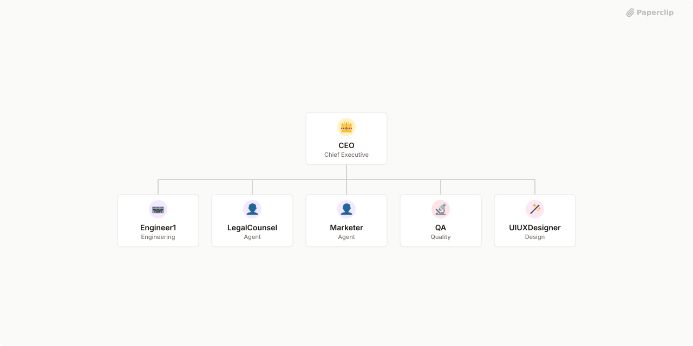

# AnrosTech



## What's Inside

> This is an [Agent Company](https://agentcompanies.io) package from [Paperclip](https://paperclip.ing)

| Content | Count |
|---------|-------|
| Agents | 6 |
| Projects | 3 |
| Skills | 4 |
| Tasks | 37 |

### Agents

| Agent | Role | Reports To |
|-------|------|------------|
| CEO | CEO | — |
| Engineer1 | Engineer | ceo |
| LegalCounsel | general | ceo |
| Marketer | general | ceo |
| QA | qa | ceo |
| UIUXDesigner | designer | ceo |

### Projects

- **AnrosTech Company** — AnrosTech: #1 Vietnam Premier Software Development and Consulting Company

Company repo: [https://github.com/anrostech/anrostech](https://github.com/anrostech/anrostech)
Website UI: [https://github.com/anrostech/anrostech-site](https://github.com/anrostech/anrostech-site)&#x20;
Website Strapi backend: [https://github.com/anrostech/anrostech-site-strapi](https://github.com/anrostech/anrostech-site-strapi)
Internal CRM: [https://github.com/anrostech/anrostech-crm](https://github.com/anrostech/anrostech-crm)

Notes:
You will ignore the folder k8s at project's root. It is used for infrastructure.
- **Mark** — Personal projects that solve some purpose:

Learning
Productivity
Career growth

\---

Job available position crawling: Reactjs, Nextjs, Nestjs, React Native.
- **Samio Bakery** — Samio Bakery: #1 Artisan for mom who taking greatest care for her family

Company repo: [https://github.com/anrostech/samio](https://github.com/anrostech/samio)
Website UI: [https://github.com/anrostech/samio-site](https://github.com/anrostech/samio-site)&#x20;
Website Strapi backend [https://github.com/anrostech/samio-site-strapi](https://github.com/anrostech/samio-site-strapi)
Internal CRM: [https://github.com/anrostech/samio-crm](https://github.com/anrostech/anrostech-crm)

Notes:
You will ignore the folder k8s at project's root. It is used for infrastructure.

### Skills

| Skill | Description | Source |
|-------|-------------|--------|
| paperclip-create-agent | > | [github](https://github.com/paperclipai/paperclip/tree/master/skills/paperclip-create-agent) |
| paperclip-create-plugin | > | [github](https://github.com/paperclipai/paperclip/tree/master/skills/paperclip-create-plugin) |
| paperclip | > | [github](https://github.com/paperclipai/paperclip/tree/master/skills/paperclip) |
| para-memory-files | > | [github](https://github.com/paperclipai/paperclip/tree/master/skills/para-memory-files) |

## Getting Started

```bash
pnpm paperclipai company import this-github-url-or-folder
```

See [Paperclip](https://paperclip.ing) for more information.

---
Exported from [Paperclip](https://paperclip.ing) on 2026-04-17
